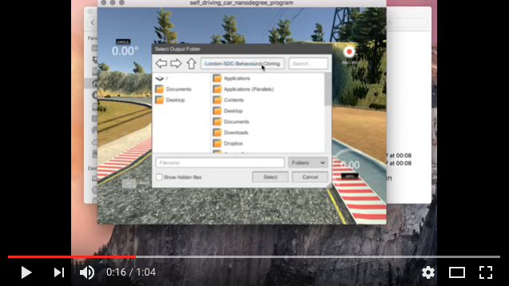
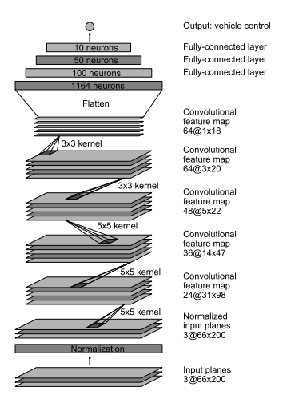
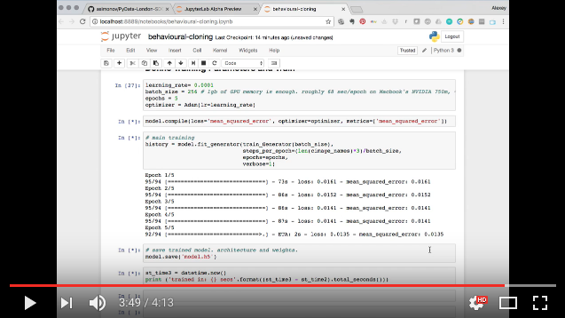
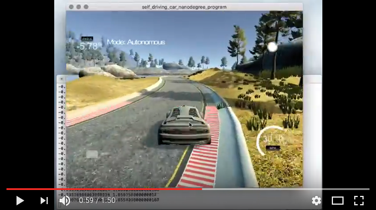

# Cloning Driving Behaviour Using Deep Learning

This demo is based on Behaviour Cloning project from Term 1 of 
Udacity Self-Driving Car Engineer Nanodegree 
[](http://www.udacity.com/drive)

[The presentation slides are here](./PyData-SDC-20170606.pdf)

Overview
---
In this project we demonstrate few aspects of developing self-driving cars, which
come together nicely in one simple project and are implemented using open source tools.

Setting: we have a car driving simulator.
The simulator sends telemetery events with a picture from 'camera', the current steering angle
and velocity. We write a program that processes the telemetery events, 
decides what steering angle and throttle to apply, and sends them to the simulator. 
The goal is to keep the car in the center of the road while driving around the track.

We can drive the car manually around the track and save the images and associated steering
angles. This gives us labelled dataset which we use to train our program how to drive like
a human. This is a supervised learning setting. We build a simple deep convolutional 
neural network (CNN) and train it to associate steering angle with an image. 

Effectively the program clones driving behaviour. 
This approach to programming self-driving cars is called end-to-end learning
because it takes raw sensor inputs (in this case image pixels) 
and produces the resulting control commands
without breaking the intermediate steps down into logical steps like
detecting lanes, objects, distances, applying if-then-else logic etc.
[This article by NVIDIA](http://arxiv.org/pdf/1604.07316v1.pdf) details how 
it was done successfully on a real car using 
[NVIDIA Drive PX](https://en.wikipedia.org/wiki/Drive_PX-series)
and about 72 hours of data, driving on different roads and in various weather conditions. 
They called their system DAVE 2 and you can see 
[video of its performance here](https://drive.google.com/file/d/0B9raQzOpizn1TkRIa241ZnBEcjQ/view).
Notice around minute 8 what image they send to the CNN and the feature maps
it produces.

Here we repeat NVIDIA success to show that anyone can program self-driving cars
using open source tools!
We use a CNN architecture similar to NVIDIA's, code it up in `Keras` and `tensorflow` 
and then use `python` script as a glue to handle telemetery events using `asincio`, 
run the prediction 
and send the controls back.

The steps of this project are the following:
* Use the simulator to collect data of good driving behavior 
* Design, train and validate a model that predicts a steering angle from image data
* Use the model to drive the vehicle autonomously around the first track in the simulator


The Simulator / Data Collection
---
Udacity has produced an open-source driving simulator based on Unity 3D engine.
You can download it [here (get Version 2 or above)](https://github.com/udacity/self-driving-car-sim).
You can even modify it for your needs if you feel adventurous!

After you start the simulator choose the desired graphics quality and resolution.
Because later we will resize the images to 80x160 pixels, do not choose too high a resolution,
as the saved images will take up more space and lenghten the preprocessing but will not
improve the quiality of the results.

Press the record button and choose the folder where the simulator creates
`IMG` folder and `driving-log.csv` files.
Then steer the car around the track for data collection. 
Here are a few points to consider:
* steering with the keyboard (left/right buttons) is quite sensitive, so you may want to
limit key press durations
* you can control steering via mouse instead of keyboard. 
This creates better angles for training. The angle is based on the mouse distance. 
To steer hold the left mouse button and move left or right. 
To reset the angle to 0 simply lift your finger off the left mouse button.
* the best data can be collected by using a joystick or a steering column, if you have them
* You can toggle record by pressing `R` key (or press `record` button on the screen)
* When recording is finished, all the captured images are saved to the disk at the same time
You will see save status and play back of the captured data.
* You can takeover in autonomous mode. While `W` or `S` are held down you can control the 
car the same way you would in training mode. 
This can be helpful for debugging. As soon as `W` or `S` are let go simulator goes back
into autonomous mode.
* Pressing the `spacebar` in training mode toggles cruise control on and off
(effectively presses `W` for you).

Here is the video of how to record the data:
[](https://youtu.be/mUV-zxdlpeE)


Install Dependencies
---

We use python 3.5 and [conda environment/package manager](http://conda.pydata.org/docs)

The steps are:

1. Install [`miniconda`](http://conda.pydata.org/miniconda.html) or full Anaconda on your computer
2. Setup `conda` [environment](http://conda.pydata.org/docs/using/envs.html)
3. Each time you wish to work, activate your `conda` environment
4. Install tensorflow


### Install conda

**Download** the version of `miniconda` that matches your system. Make sure you download the version for Python 3.5.

|        | Linux | Mac | Windows | 
|--------|-------|-----|---------|
| 64-bit | [64-bit (bash installer)][lin64] | [64-bit (bash installer)][mac64] | [64-bit (exe installer)][win64]
| 32-bit | [32-bit (bash installer)][lin32] |  | [32-bit (exe installer)][win32]

[win64]: https://repo.continuum.io/miniconda/Miniconda3-latest-Windows-x86_64.exe
[win32]: https://repo.continuum.io/miniconda/Miniconda3-latest-Windows-x86.exe
[mac64]: https://repo.continuum.io/miniconda/Miniconda3-latest-MacOSX-x86_64.sh
[lin64]: https://repo.continuum.io/miniconda/Miniconda3-latest-Linux-x86_64.sh
[lin32]: https://repo.continuum.io/miniconda/Miniconda3-latest-Linux-x86.sh

**Install** [miniconda](http://conda.pydata.org/miniconda.html) on your machine. Detailed instructions:

- **Linux:** http://conda.pydata.org/docs/install/quick.html#linux-miniconda-install
- **Mac:** http://conda.pydata.org/docs/install/quick.html#os-x-miniconda-install
- **Windows:** http://conda.pydata.org/docs/install/quick.html#windows-miniconda-install


### Setup Virtual Environment


**Create** your the `pydata-sdc` conda environment. 

```
conda env create -f environment.yml python=3.5
```

**Verify** that the carnd-term1 environment was created in your environments:

```sh
conda info --envs
```

**Cleanup** downloaded libraries (remove tarballs, zip files, etc):

```sh
conda clean -tp
```

To delete the environment when you dont need it:

```sh
conda env remove -n pydata-sdc
```


### Activate Environment

Now that you have created an environment, in order to use it, you will need to activate the environment. This must be done **each** time you begin a new working session i.e. open a new terminal window. 

**Activate** the `pydata-sdc` environment:

On **OS X** and **Linux**:
```sh
$ source activate pydata-sdc
```

On **Windows**, depending on shell either:
```sh
$ source activate pydata-sdc
```
or

```sh
$ activate pydata-sdc
```

When you are in `pydata-sdc` virtual environment you see `(pydata-sdc)` at the beginning
of the shell prompt.


### Install Tensorflow

If you **DO** have an NVIDIA GPU and CUDA drivers, install GPU version of tensorflow: 

```sh
(pydata-sdc) $ pip install tensorflow-gpu==1.0.0
```

otherwise setup CPU version which should work on wide range of hardware: 

```sh
(pydata-sdc) $ pip install tensorflow==1.0.0
```


Define and Train the Model
---

We define and train our model in `Jupyter` notebook called `behavioural-cloning.ipynb`
Start it up using the following command and then follow the instructions inside:

```sh
(pydata-sdc) $ jupyter notebook behavioural-cloning.ipynb
```

The runtime of this notebook for about 8000 images in `IMG` folder
should be between 8 and 30 minutes, depending on hardware you use.
If you use GPU the default batch size of 256 images requires that you have
around 1gGb of GPU memory available for this notebook to run.

This is the original architecture of NVIDIA CNN:



We use a slightly modified version (sorry, did not have time to produce proper
diagram)


Here is the video of how we train the model:
[](https://youtu.be/P8yLEI0WZ6w)


Run the Model
---

Now that we have a trained model (which is saved in `model.h5` file) we
can use it to drive the car! We use `drive.py` script that does it. The
script does a few things:

1. load model from the file
2. starts telemetery server
3. initializes PI controller to adjust the throttle
4. processes incoming events and runs steering angle prediction

Here is the video of the car being driven by the deep net:
[](https://youtu.be/bJIBrPqFCd0)

It looks a little wobbly, but that is just based on simple augmentation
of driving data consisting of about 3 laps of driving. And using a simple
deep neural net that was trained for just 5 epochs in 10 minutes.
You can see the potential!


Note: There is known local system's setting issue with replacing "," with "." when using drive.py. When this happens it can make predicted steering values clipped to max/min values. If this occurs, a known fix for this is to add "export LANG=en_US.utf8" to the bashrc file.

